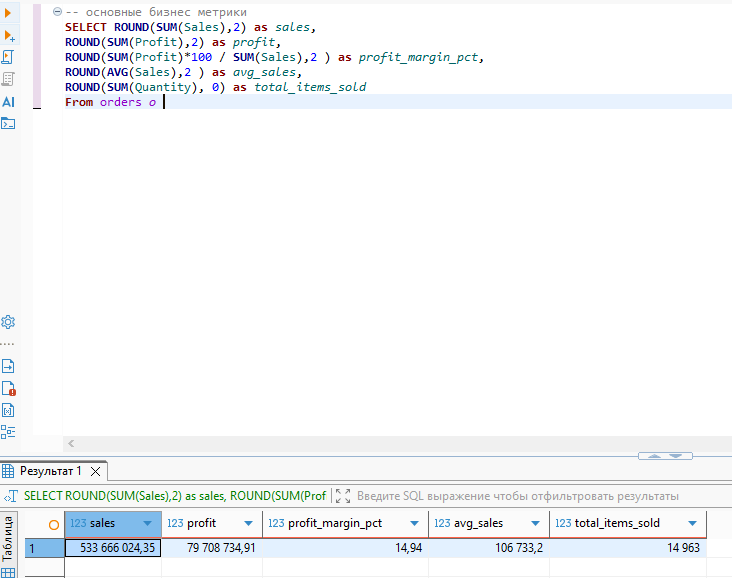
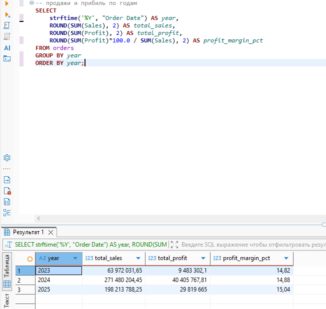
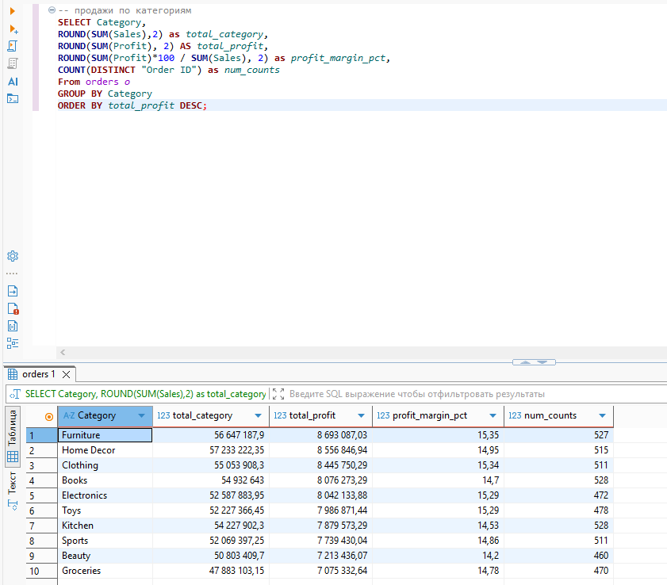
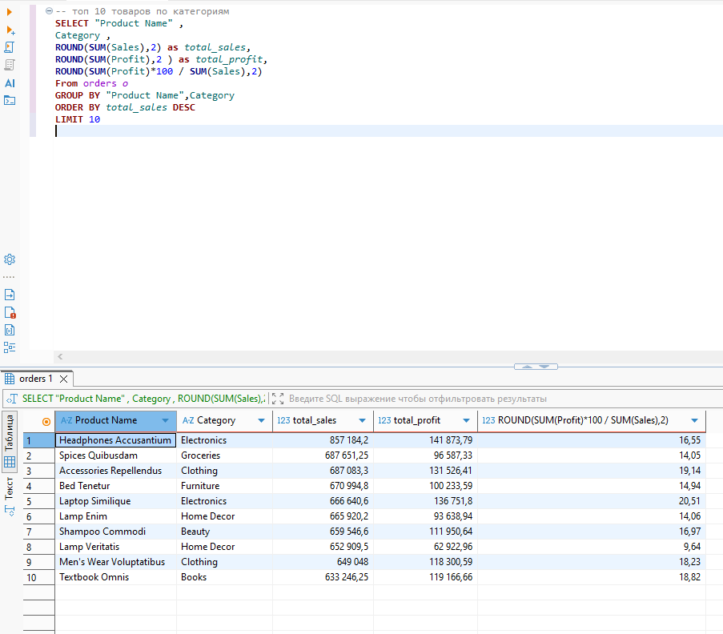
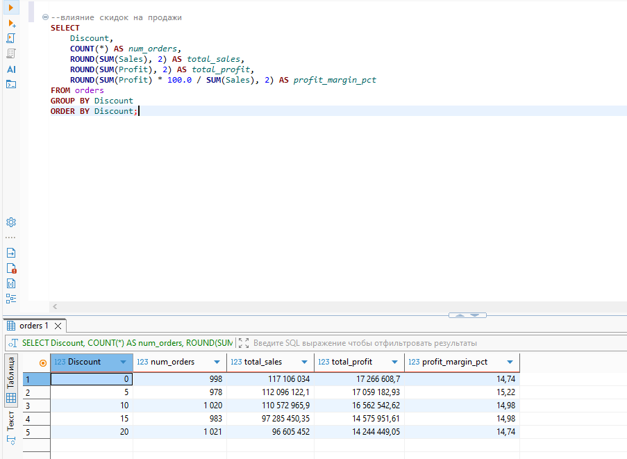
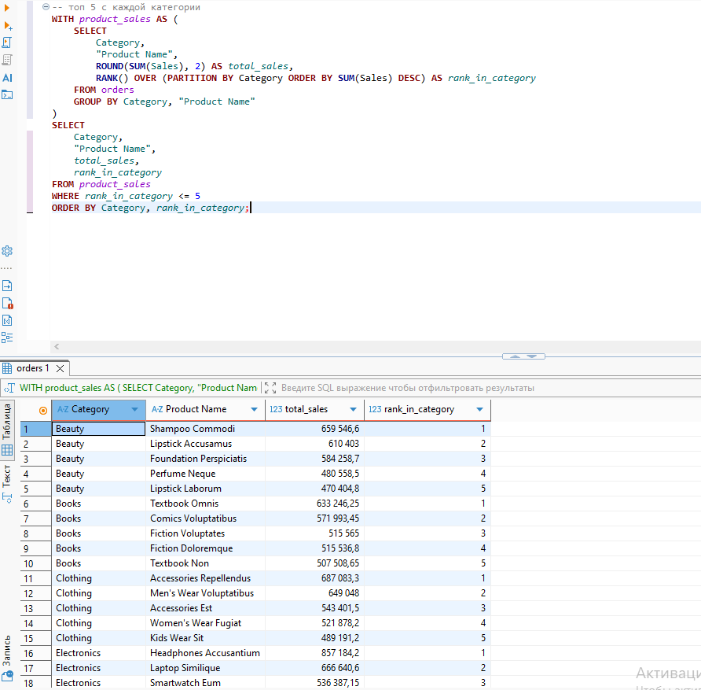

# Superstore-Sales-Analysis
SQL-анализ продаж интернет-магазина | Оконные функции, бизнес-инсайты
# Анализ продаж интернет-магазина Superstore (SQL Portfolio)

**Проект по анализу продаж и прибыли** с использованием продвинутого SQL.  
Цель — найти ключевые бизнес-инсайты, проблемные зоны и дать рекомендации.

### О проекте
- **Источник данных**: Ecommerce Sales Dataset (Superstore)
- **Период**: 2023–2025 гг.
- **Объём данных**: ~5000 строк
- **Инструменты**: SQLite, DBeaver, SQL (оконные функции, CTE)

### Навыки, которые демонстрирует проект
- Агрегация и группировка
- Оконные функции (`RANK() OVER`)
- CTE (Common Table Expressions)
- Расчёт бизнес-метрик (маржа, running total, сезонность)
- Анализ влияния скидок

### Ключевые инсайты

1. **Общая картина бизнеса**  
   Общая выручка: **533 666 024 $**  
   Общая прибыль: **79 708 735 $**  
   Средняя маржинальность: **14.94%**  
   Средний чек: **106 733 $**

2. **Динамика по годам**  
   Сильный рост в 2024 году: выручка выросла до **271 480 204 $** (в 4+ раза по сравнению с 2023).  
   Маржинальность стабильна на уровне **14.8–15.0%**.

3. **Анализ по категориям товаров**  
   Самая прибыльная категория — **Furniture** (прибыль 8 693 087 $).  
   Самая низкая маржинальность у категории **Beauty** (14.2%).

4. **Влияние скидок**  
   Лучшая маржинальность при скидке **0% и 15%**.  
   Даже небольшие скидки (5–20%) заметно снижают прибыль.

5. **Топ-5 товаров в каждой категории**  
   С помощью оконной функции `RANK() OVER (PARTITION BY Category ...)` выявлены лидеры продаж внутри каждой категории.

6. **Сезонность продаж**  
   Пиковые месяцы: **март, сентябрь, октябрь, ноябрь**.  
   Самый слабый месяц — **февраль**.
### Структура проекта
- `sql/` — все SQL-запросы 
- `images/` — скриншоты результатов 
- `data/` — исходные данные

### Как запустить
1. Открыть `superstore.db` в DBeaver
2. Выполнить запросы из папки `sql/`

### Следующие шаги
- Создание дашборда в Power BI
- RFM-анализ клиентов

### Примеры результатов анализа

